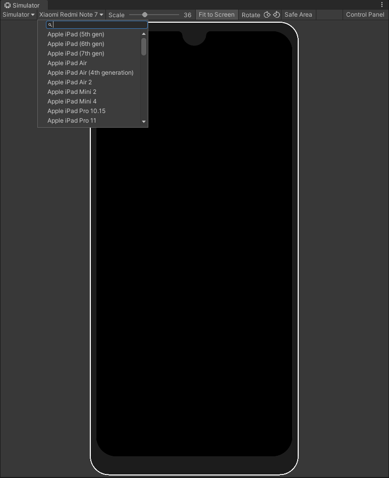

# PhysicsModule

## UnityEngine.ForceMode
ForceMode为枚举类型，用来控制力的作用方式，有4个枚举成员，在以下举例中均设刚体质量为m=2.0f，力向量为f=(10.0f,0.0f,0.0f)。
1. ForceMode.Force：默认方式，使用刚体的质量计算，以每帧间隔时间为单位计算动量。设FixedUpdate()的执行频率采用系统默认值（即0.02s），则由动量定理
f•t=m•v
可得：10*0.02=2*v1，从而可得v1=0.1，即每帧刚体在X轴上值增加0.1米，从而可计算得刚体的每秒移动速度为v2=(1/0.02)*v1=5m/s。
2. ForceMode.Acceleration：在此种作用方式下会忽略刚体的实际质量而采用默认值1.0f，时间间隔以系统帧频间隔计算（默认值为0.02s），即
f•t=1.0•v
即可得v1= f•t=10*0.02=0.2，即刚体每帧增加0.2米，从而可得刚体的每秒移动速度为v2=(1/0.02)*v1=10m/s。
3. ForceMode.Impulse：此种方式采用瞬间力作用方式，即把t的值默认为1，不再采用系统的帧频间隔，即
f•1.0=m•v
即可得v1=f/m=10.0/2.0=5.0，即刚体每帧增加5.0米，从而可得刚体每秒的速度为v2=(1/0.02)*5.0=250m/s。
4. ForceMode.VelocityChange：此种作用方式下将忽略刚体的实际质量，采用默认质量1.0，同时也忽略系统的实际帧频间隔，采用默认间隔1.0，即
f•1.0=1.0•v
即可得v1=f=10.0，即刚体每帧沿X轴移动距离为10米，从而可得刚体每秒的速度为v2=(1/0.02)*v1=500m/s。

